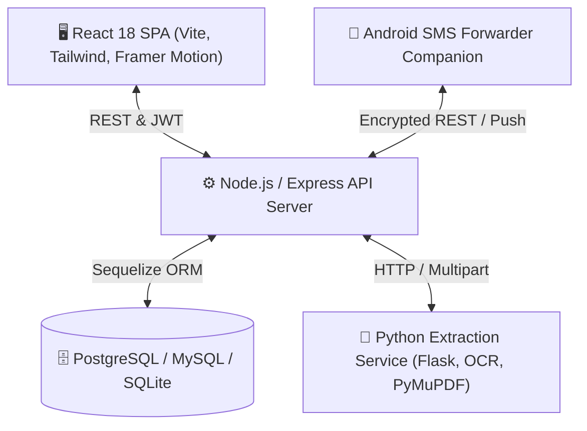

# 💰 Personal Expense Manager (PEM)

[](https://opensource.org/licenses/MIT)
[](https://nodejs.org/)
[](https://reactjs.org/)
[](https://www.postgresql.org/)
[](https://vitejs.dev/)

> **PEM (Personal Expense Manager)** is an all-in-one personal finance, wealth tracking, and banking automation platform. It seamlessly connects daily expense tracking, credit card management, investment portfolios, automated loan amortization, and real-time Android SMS transaction extraction into a modern financial command center.

---

## 🚀 Key Highlights & Features

### 📊 Financial Dashboard & Analytics
- **Real-Time Wealth Overview**: Live net worth calculation, monthly cash flow, liquidity balances, and burn rate.
- **Smart Category Analytics**: Interactive donut charts and breakdown of essential vs. discretionary spending.
- **Monthly Trend Visualizer**: High-performance charting powered by Recharts with dynamic dark/light theme switching.

### 💳 Credit Card Command Center
- **Card Lifecycle Management**: Track card limits, available credit, statement cycles, and grace periods.
- **Step-Up Security Shield**: Sensitive card details, CVVs, and statement generation are protected by 15-minute dedicated password-authenticated sessions.
- **EMI Amortization & Breakdown**: Detailed tenure analysis, principal vs. interest breakdown, and terms calculation.
- **Automated Statement Engine**: Automatic statement billing date alerts and due date reminders.

### 📈 Investment & Wealth Portfolio
- **Multi-Asset Portfolio**: Track Mutual Funds, Equities, Fixed Deposits, Gold/SGBs, Real Estate, and Crypto.
- **CAS Statement Parser**: Automated import for CAMS and KFintech consolidated account statements.
- **Market Data Feeds**: Integrated with Alpha Vantage & Twelve Data for real-time NAV and stock price synchronizations.
- **Goal-Based Investing**: Define life milestones (Emergency Fund, House Down Payment, Retirement) with asset allocation mapping.
- **Tax Intelligence**: Capital gains calculation supporting both Short-Term (STCG) and Long-Term (LTCG) estimations.
- **SIP Tracker**: Systematic investment plan schedules, upcoming deductions, and active status tracking.

### 🏦 Loans & EMI Manager
- **Smart Payment Calendar**: Intelligent EMI scheduler that only activates the payment flow when an EMI is due on its specified date.
- **Historical Payment Logs**: Mark EMIs as paid with automatic interest/principal balance reconciliation.
- **Loan Types Supported**: Home loans, personal loans, vehicle loans, and educational credit lines.

### 📱 Android SMS Forwarder & Automation
- **Zero-Touch Expense Logging**: Native Android companion app parses transactional bank SMS messages in real-time.
- **Dynamic QR Code Pairing**: Scan to pair your mobile device in seconds. Once verified via TOTP/Device ID, the QR code automatically transitions to a secured "Device Paired & Active" status dashboard.
- **Push Notification Verification**: Real-time push requests to accept or decline sensitive operations directly on your mobile device.
- **AES-Encrypted Handshake**: End-to-end encrypted device authentication using unique device API keys.

### 🛡️ Enterprise-Grade Security
- **Multi-Factor Authentication (MFA)**:
  - Time-based One-Time Passwords (TOTP) with Google Authenticator / Authy.
  - Mobile Push notification approval for zero-friction login.
- **Granular Session Controls**: 24-hour JWT auth paired with short-lived session step-ups for sensitive actions.
- **Role-Based Access Control (RBAC)**: Support for Admin, Standard User, and Shared Family/Group accounts.

### 📄 Intelligent Document Extraction Microservice
- **Python OCR Service**: Flask-powered microservice integrating **Tesseract OCR** and **PyMuPDF**.
- Automatically extracts tabular statements, invoices, and transaction slips into structured JSON records.

---

## 🏗️ Architecture & Tech Stack



| Layer | Technologies |
| :--- | :--- |
| **Frontend** | React 18, Vite, Framer Motion, Lucide React, Recharts, TailwindCSS, jsPDF |
| **Backend** | Node.js (v18+), Express, Sequelize ORM, JWT, Speakeasy (TOTP), Firebase Admin SDK |
| **Database** | PostgreSQL (recommended), MySQL, SQLite supported |
| **Microservice** | Python 3.10+, Flask, Tesseract OCR, PyPDF2, Pandas |
| **Mobile Companion** | Android Native (SMS & Push Notification Forwarder) |

---

## 📁 Repository Structure

```
PEM/
├── client/                     # React Frontend application
│   ├── src/
│   │   ├── components/         # Reusable UI components & modals
│   │   ├── context/            # AuthContext, ThemeContext, etc.
│   │   ├── pages/              # Dashboard, Cards, Investments, Loans, Automation
│   │   └── config.js           # API endpoints configuration
│   ├── package.json
│   └── vite.config.js
│
├── server/                     # Node.js Express API server
│   ├── config/                 # Database configuration (Sequelize)
│   ├── middleware/             # Auth, MFA, validation, error handlers
│   ├── models/                 # Sequelize database models (Users, Investments, Loans, etc.)
│   ├── routes/                 # Modular API endpoints (auth, credit_card, investing, loans, sms)
│   ├── services/               # Business logic, MFA, Market data sync
│   ├── .env.example            # Backend environment template
│   └── index.js                # Server entry point
│
├── python-extraction-service/  # Statement & OCR extraction microservice
│   ├── services/               # Statement parsers (HDFC, ICICI, SBI, Axis, etc.)
│   ├── app.py                  # Flask service entry point
│   ├── requirements.txt        # Python dependencies
│   └── .env.example            # Python service environment template
│
└── README.md                   # Project documentation
```

---

## ⚡ Quick Start Guide

### Prerequisites
- **Node.js** (v18.x or later)
- **npm** (v9.x or later)
- **PostgreSQL** (v14+ or MySQL 8+)
- **Python** (v3.10+ with pip, optional for OCR service)
- **Tesseract OCR** (optional, for physical document scanning)

---

### 1. Database Setup
Create a PostgreSQL database:
```sql
CREATE DATABASE expense_manager;
```

---

### 2. Backend Server Setup
```bash
cd server

# Install dependencies
npm install

# Copy environment template
cp .env.example .env

# Configure your database credentials and JWT secret in .env
# DB_DIALECT=postgres
# DB_HOST=localhost
# DB_PORT=5432
# DB_USER=postgres
# DB_PASS=your_password
# DB_NAME=expense_manager

# Start the server
npm start
# Server starts on http://localhost:5005
```

---

### 3. Frontend Client Setup
```bash
cd ../client

# Install dependencies
npm install

# Start the development server
npm run dev
# Client starts on http://localhost:5173
```

---

### 4. Python Extraction Microservice (Optional)
```bash
cd ../python-extraction-service

# Create and activate a virtual environment
python -m venv venv
# On Windows:
venv\Scripts\activate
# On Linux/macOS:
source venv/bin/activate

# Install requirements
pip install -r requirements.txt

# Copy environment file
cp .env.example .env

# Start Flask service
python app.py
# Microservice starts on http://localhost:5002
```

---

## 🔒 Security & Privacy

- **Zero Third-Party Telemetry**: Your financial statements and transaction logs remain self-hosted and on-premise.
- **Sensitive Storage Encryption**: Device tokens, encryption keys, and card credentials utilize AES encryption at rest.
- **Air-Gapped QR Pairing**: Device authentication uses short-lived, single-use tokens paired with hardware identifiers.
- **Automatic Session Expiration**: Credit card details auto-lock after 15 minutes of inactivity.

---

## 🤝 Contributing

Contributions, feature requests, and issue reports are welcome!
1. Fork the Project
2. Create your Feature Branch (`git checkout -b feature/AmazingFeature`)
3. Commit your Changes (`git commit -m 'Add some AmazingFeature'`)
4. Push to the Branch (`git push origin feature/AmazingFeature`)
5. Open a Pull Request

---

## 📝 License

Distributed under the **MIT License**. See `LICENSE` for more information.
